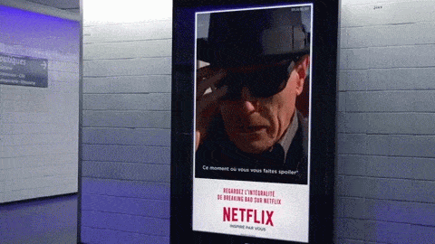
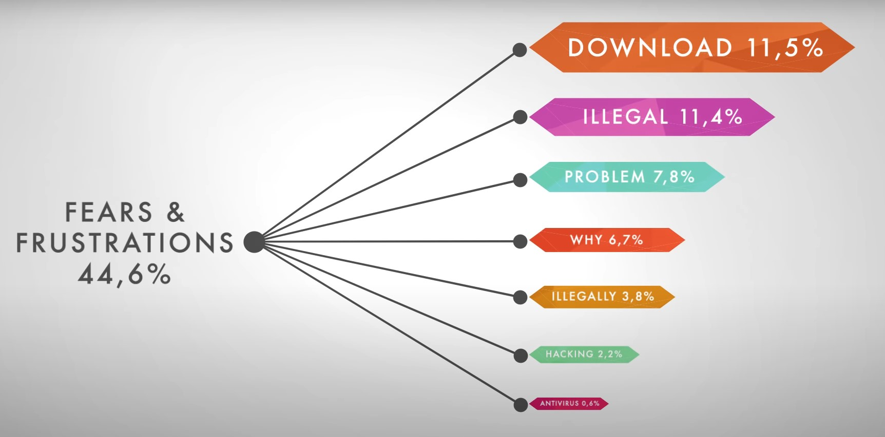

Search Youtube for a suitable business case example on data driven decision making and copy the embed code below.

<iframe width="560" height="315" src="https://www.youtube.com/embed/tZkILxaANLU" frameborder="0" allow="accelerometer; autoplay; clipboard-write; encrypted-media; gyroscope; picture-in-picture" allowfullscreen data-external="1"></iframe>

## Why was data driven decision making (3DM) useful in this business case?

It helped Netflix grow adoption of their service in the French market. 

By analysing 2 years worth of digital conversations through a natural language processing system, they were able to better understand the French mindset. Thus, they created a marketing campaign consisting of GIFs that were uniquely suited to the tastes of the French market and connected with the audience on a personal level.

The french identified so much with the GIFs that Netflix was able to almost triple its brand awareness in only three months - all thanks to data.

## How did the organization apply 3DM?

They used a topics model (a natural language processing system) to transform a massive amount of everyday language into insights into French people's preferences. They analized two years of digital conversations to process the data into different categories of meaning.

They used machine learning to train the algorithm to get better at categorization. Then they interpreted all the data with their knowledge of the local market to come up with three essential insights:

1. The french love culture but they are among Europe's biggest pirates
2. They love innovation but they're skeptical of what's new
3. They love revolution but they're very conservative

Thanks to topics models they were able to gain insights into the French people's way of a life and create a campaign made of GIFs that connects with the French audience on a personal level. 

This allowed them to address some of the market's needs and concerns - for example they addressed the French's skepticism by promoting the free trial of Netflix.

## What can the organization do with 3DM that they couldn’t do before?

What data allowed Netflix to do is develop an effective marketing campaign. They would not have had this level of success (3x gain in brand awareness) if it weren't for the insights that they extracted from the French's digital conversations.

